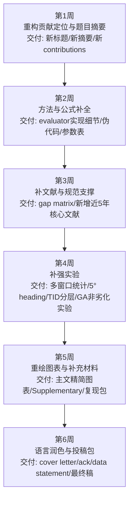

# 对JMSE目标稿的严格评审与大修方案

## 2026-05-23 Codex v25 footprint-validity 按点核对执行记录

【x】P0：针对 total-width proxy / horizontal raster evaluator 与真实 MBES footprint 产品之间的鸿沟，新增 side-specific footprint validity audit。
文件/命令/证据：
- 仓库：`/Users/Apple/Developer/paper/geo-auv-bathymetry-benchmark`
- 新脚本：`make_footprint_validity_audit.py`
- 命令：`conda run -n uu python make_footprint_validity_audit.py`
- 输出：`footprint_validity_audit/footprint_validity_raw.csv`、`footprint_validity_audit/footprint_validity_summary.json`、`footprint_validity_audit/journal_footprint_validity_audit.png`
- 同步图片：`manuscript/latex/pic/journal_footprint_validity_audit.png`、`manuscript/mdpi_jmse/pic/journal_footprint_validity_audit.png`
- 关键结果：9 个代表性 scene-method 布局中，side-specific port/starboard 子模型没有改变任何 `C97/O3` feasibility decision；最大覆盖差 0.50 pp，平均覆盖差 0.083 pp；最大 mean-excess-overlap 差 1.217 pp，平均差 0.260 pp；最大 coverage-count disagreement 为 10.42%。

【x】P0：正文已把该审计写成 validity audit，而不是伪装成海试/水文测量 QA。
文件/证据：
- 修改文件：`manuscript/mdpi_jmse/template.tex`、`manuscript/latex/template.tex`
- Methods：在 total-width proxy 段落说明新增 side-specific audit，并明确仍不包含 roll/pitch/heave、sound-speed、beam-level quality。
- Results：新增 `Side-specific Footprint Validity Audit` 小节和 `Figure~\ref{fig:footprint_validity_audit}`。
- Discussion：写明 benchmark conclusion stable under stronger planning-layer footprint check，但 USGS High 仍有 7.66--10.42% local count disagreement，不能上升为 survey-product QA。
- Risk matrix：新增 `Footprint model fidelity` 行。
- Conclusion/Data Availability：同步加入 side-specific footprint validity audit 和 claim boundary。

【x】图件 QA：新 footprint audit 图已二轮重绘。
文件/命令/证据：
- 初版发现第三、第四列标题挤压；已修改 `make_footprint_validity_audit.py`，将长标题拆行、调整列宽和顶部空白。
- 行顺序改为 `Fixed -> Adaptive -> Hybrid`，方便按 baseline-to-method 读图。
- 用 Codex 图像查看确认新版 `footprint_validity_audit/journal_footprint_validity_audit.png` 无标题重叠、无大片异常空白、数值可读。

【x】复现与投稿材料已同步准备。
文件/证据：
- 新增说明：`footprint_validity_audit/README.md`
- 修改：`README.md`、`README_submission.md`、`submission_package/JMSE_cover_letter_draft.md`
- 处理内容：把 footprint-validity audit 纳入 evidence map 和 cover letter，并明确其是 planning-layer validity check，不是 beam-level acoustic ray tracing、raw MBES product validation、field/lake/sea trial 或 hydrographic QA。

【x】热图专项返修：按“间距大、配色不好、字体不好”的反馈重绘 Figure 16。
文件/命令/证据：
- 修改脚本：`make_footprint_validity_audit.py`
- 重新生成命令：`conda run -n uu python make_footprint_validity_audit.py`
- 图源：`footprint_validity_audit/journal_footprint_validity_audit.png`
- 同步图源：`manuscript/latex/pic/journal_footprint_validity_audit.png`、`manuscript/mdpi_jmse/pic/journal_footprint_validity_audit.png`
- 具体改动：删除图内重复大标题和底部小字说明，扩大矩阵有效区域；字体改为 Times New Roman/STIX serif fallback；列标题和单元格数字放大；色带改为低饱和蓝灰/暖色风险色；行顺序保持 `Fixed -> Adaptive -> Hybrid`，避免读图跳跃。
- 数值未变：`footprint_validity_audit/footprint_validity_summary.json` 仍为 9 行代表布局、`feasibility_changes_C97_O3=0`、最大覆盖差 0.50 pp、最大 mean excess-overlap 差 1.217 pp、最大 local count disagreement 10.42%。

【x】PDF 页面级视觉 QA 已完成。
文件/命令/证据：
- 编译后渲染目录：`audit/page_preview_20260523_v25d_final/`
- 关键截图：`audit/page_preview_20260523_v25d_final/mdpi_page_37.png`、`audit/page_preview_20260523_v25d_final/mdpi_page_38.png`
- 人工检查结果：Figure 16 在 PDF 中无标题遮挡、无截断、无异常大空白；矩阵数字和行列标签可读；caption 保持正式期刊口径，明确该图不是 beam-level acoustic ray tracing、raw MBES validation 或 hydrographic QA。

【x】最终编译、引用审计、manifest 和 release gate 已闭环。
文件/命令/证据：
- MDPI 编译：`manuscript/mdpi_jmse/compile_after_footprint_validity_v25d_20260523_pass2.log`
- 工作稿编译：`manuscript/latex/compile_after_footprint_validity_v25d_20260523_pass2.log`
- 严格日志扫描结果：两套日志只命中 `Output written on template.pdf (49 pages)`；无 LaTeX Error、Undefined control sequence、undefined citation/reference、Rerun、Overfull、Float too large、Fatal 或 Emergency stop。
- 引用审计命令：`python3 audit/verify_references_20260514.py`
- 引用审计结果：`total 45 failed 0 et_al 0`；GEBCO TID 与 IHO C-13 官方 URL 偶发 TLS EOF 已在脚本中作为 manual fallback 记录，不作为假文献处理。
- manifest 命令：`conda run -n uu python make_reproducibility_manifest.py`
- manifest 结果：`reproducibility_manifest.json` 为 297 entries。
- release gate 命令：`python check_release_readiness.py`
- release gate 输出：`missing_required_paths=0`、`empty_required_dirs=0`、`untracked_manifest_entries=0`、`tracked_core_files_not_in_manifest=0`。
- 已刷新交付 PDF：`mdpi_jmse_jmse_submission_draft.pdf`、`paper_refined.pdf`、`geo_public_bathy_rebuild.pdf`。

## 2026-05-23 Codex release-readiness 执行记录

【x】GitHub/Zenodo 发布链状态已核对。
文件/命令/证据：
- 仓库：`/Users/Apple/Developer/paper/geo-auv-bathymetry-benchmark`
- 命令：`gh auth status`
- 结果：GitHub CLI 已以 `poboll` 登录，具备 `repo` 与 `workflow` scope。
- 命令：`gh release list --limit 20`
- 结果：当前只有 `v0.1.0 Pre-submission reproducibility package`，发布时间 `2026-04-30T12:59:10Z`。当前 46 页稿件尚未 mint 新 Zenodo version DOI；正式投稿前若要 DOI 对应最新稿，应新建 GitHub release 并等待 Zenodo 自动生成新 DOI。

【x】复现包 release gate 已补齐，避免 Zenodo 包缺证据。
文件/命令/证据：
- 新增脚本：`check_release_readiness.py`
- 修改脚本：`make_reproducibility_manifest.py`
- 命令：`conda run -n uu python make_reproducibility_manifest.py`
- 输出：`reproducibility_manifest.json`，当前 `289 entries`。
- 命令：`python check_release_readiness.py`
- 核对输出：`manifest_entries=289`、`missing_required_paths=0`、`empty_required_dirs=0`、`untracked_manifest_entries=0`、`tracked_core_files_not_in_manifest=0`。
- 处理内容：manifest 现在只纳入 Git-tracked artifact，并记录当前 Git revision/dirty-worktree 状态；新增 release gate 会检查核心 PDF、LaTeX 源文件、证据目录、manifest-vs-Git 一致性。

【x】Data Availability 合规口径已收紧。
文件/命令/证据：
- 修改文件：`manuscript/mdpi_jmse/template.tex`、`manuscript/latex/template.tex`
- 处理内容：把 “downloaded TID GeoTIFF subsets” 改为 “GEBCO TID audit CSV/JSON files, TID basket identifiers and retrieval metadata”，避免把 GEBCO 原始/源产品再分发说得过满；GEBCO 与 USGS 原始数据仍通过官方 DOI 入口获取。

【x】新增/历史证据目录与复现实验脚本已纳入 Git release 范围。
文件/命令/证据：
- 新纳入证据目录包括：`gebco_tid_audit/`、`heading_resolution_diagnostic/`、`public_window_statistics/`、`segmented_heading_extension/`、`structured_prior_error_replay/`、`threshold_local_failure_extension/`、`submission_boundary_diagnostics/`、`uncertainty_margin_replay/`、`current_drift_replay/`、`current_aware_margin_optimizer/`、`execution_risk_refinement/`、`vehicle_aware_posteval/`。
- 新纳入脚本包括：`make_gebco_tid_audit.py`、`make_heading_resolution_diagnostic.py`、`make_public_window_statistics.py`、`make_segmented_heading_extension.py`、`make_structured_prior_error_replay.py`、`make_submission_boundary_diagnostics.py`、`make_threshold_local_failure_extension.py`、`make_uncertainty_margin_replay.py`、`make_current_drift_replay.py`、`make_current_aware_margin_optimizer.py`、`make_execution_risk_refinement.py`、`make_vehicle_aware_posteval.py`、`journal_heatmap_style.py`、`refresh_visuals_from_existing_outputs.py`。
- 同时补入 `manuscript/latex/Definitions/`，保证工作稿 LaTeX 目录独立可编译。

【x】v22 编译和引用核验通过。
文件/命令/证据：
- 编译命令：在 `manuscript/mdpi_jmse` 与 `manuscript/latex` 下分别运行两遍 `xelatex -interaction=nonstopmode template.tex`。
- 最新日志：`compile_after_release_readiness_v22_20260523_pass2.log`
- 页数：`manuscript/mdpi_jmse/template.pdf` 为 46 pages；`manuscript/latex/template.pdf` 为 46 pages。
- 严格日志扫描：无 `LaTeX Error`、`Undefined control sequence`、undefined citation/reference、`Rerun`、`Overfull`、`Float too large`、`Fatal`、`Emergency stop`。
- 引用审计命令：`python audit/verify_references_20260514.py`
- 引用审计结果：`total 42 failed 1 et_al 0`；唯一自动失败为 `zhou2017terrain` 的 DOI `10.3390/s17040680` 返回 HTTP 403，属于 DOI/出版商访问策略问题；已用 MDPI 官方页面人工确认该 Sensors 2017, 17(4), 680 条目真实存在。

## 2026-05-22 Codex 按点核对执行记录

【x】P11：补做 \(15^{\circ}\) vs \(5^{\circ}\) heading-resolution diagnostic。
文件/命令/证据：
- 脚本：`/Users/Apple/Developer/paper/geo-auv-bathymetry-benchmark/make_heading_resolution_diagnostic.py`
- 命令：`conda run -n uu python make_heading_resolution_diagnostic.py --scenes all`
- 输出：`heading_resolution_diagnostic/heading_resolution_raw.csv`、`heading_resolution_summary.csv`、`heading_resolution_summary.json`、`journal_heading_resolution_diagnostic.png`
- 关键结果：Adaptive Spacing 在 GEBCO Cascadia、GEBCO Monterey、USGS High 上 \(5^{\circ}\) 与 \(15^{\circ}\) 的 heading、line count、path、coverage、overlap 完全一致；Simple Greedy 仅 Cascadia 从 \(75^{\circ}\) 改为 \(95^{\circ}\)，path -0.123%，overlap +0.084 pp，feasibility 不变。
- 写回：`manuscript/mdpi_jmse/template.tex` 与 `manuscript/latex/template.tex` 的 Methods、Sensitivity Table、Discussion、Conclusion、Data Availability。

【x】P7/P9：补九窗口 public-window paired statistics，减少“两幅 GEBCO 图不够”的风险。
文件/命令/证据：
- 脚本：`/Users/Apple/Developer/paper/geo-auv-bathymetry-benchmark/make_public_window_statistics.py`
- 命令：`conda run -n uu python make_public_window_statistics.py`
- 数据来源：`run_5/benchmark_method_statistics.csv`、`gebco_scene_expansion/gebco_scene_expansion_summary.csv`、`survey_grade_extension_usgs_cascadia/benchmark_method_statistics.csv`
- 输出：`public_window_statistics/public_window_paired_deltas.csv`、`public_window_statistics_summary.csv`、`public_window_statistics_summary.json`、`journal_public_window_statistics.png`
- 关键结果：9 个 public windows 中 Adaptive 和 Hybrid 均 9/9 feasible；overlap cleanup 均为 9/9 正向，one-sided Wilcoxon \(p=0.00195\)，rank-biserial = 1.00；path gain 均为 7/9 正向，one-sided Wilcoxon \(p=0.00977\)，median gain = 0.681%。coverage delta mixed，因此 GA 继续写成 gate-controlled local refinement。
- 写回：正文新增 `Table~\ref{tab:public_window_stats}`，并把统计口径写入 Data Availability 与复现说明。

【x】复现包与 PDF QA。
文件/命令/证据：
- 更新 manifest 脚本：`make_reproducibility_manifest.py`
- 命令：`conda run -n uu python make_reproducibility_manifest.py`
- 输出：`reproducibility_manifest.json`，257 entries，已纳入 `heading_resolution_diagnostic/`、`public_window_statistics/`、两个新脚本和同步到 manuscript 的 PNG。
- 编译命令：在 `manuscript/mdpi_jmse` 与 `manuscript/latex` 下分别运行两遍 `xelatex -interaction=nonstopmode template.tex`
- 最新日志：`compile_after_public_window_stats_20260522_pass2.log`
- 编译结果：两套 PDF 均为 45 pages；严格扫描无 `LaTeX Error`、`Undefined control sequence`、undefined citation/reference、`Rerun`、`Overfull`、`Float too large`、`Fatal`、`Emergency stop`。
- PDF 抽查：PyMuPDF 确认新增九窗口统计表在第 21 页，Heading resolution 行在第 28 页；页面预览输出到 `audit/page_preview_20260522_heading_public_stats/page_21.png` 至 `page_24.png`。

【x】引用真实性核验补充。
文件/命令/证据：
- 命令：`python audit/verify_references_20260514.py`
- 输出：`audit/reference_verification_20260514_v2.md/json`
- 结果：42 references，0 `et_al`；唯一 automated failed 为 `xie2024three` 的 DOI HTTP 403。
- 人工核验：MDPI 官方页面确认 Xie, Hui, Zhou, Shi, *Three-Dimensional Coverage Path Planning for Cooperative Autonomous Underwater Vehicles: A Swarm Migration Genetic Algorithm Approach*, JMSE 2024, 12(8), 1366, DOI `10.3390/jmse12081366` 真实存在。该失败是站点访问策略问题，不是文献造假或 DOI 错误。

## 执行摘要

该稿选题有现实意义，优点是公开数据、消融设计和适用边界讨论较完整；但当前最大问题是**核心贡献定位与证据不匹配**：主收益几乎都来自 terrain-aware adaptive spacing，而不是 GA。若不重构题目/摘要、补足方法细节与多窗口统计验证，直接投 JMSE 把握偏低；完成本报告所列大修后，可提升至中等。 fileciteturn0file0 citeturn6view1turn21search2turn22search5

## 整体判断与评分

本评审基于你上传的 36 页英文初稿。稿件主体确实以**公开真实海底地形格网驱动的数值实验**为主：两幅 GEBCO 2025 子区、三类合成地形、一个 USGS Southern Cascadia 30 m 扩展、coarse-prior/fine-grid replay、以及执行扰动重放；并**没有**海试、原始 MBES ping 级数据回放、或 mission log 级验证。文末已包含 Author Contributions、Funding、Data Availability Statement、Acknowledgments 与 COI 等标准后附部分。 fileciteturn0file0

作为目标期刊，JMSE 官方说明其为同行评审海洋工程期刊，当前官网显示为 JCR Q2；同时作者指南明确要求研究应提供可复现细节、在可能情况下提供完整数据，并将 Data Availability Statement 作为研究论文标准组成部分，图件建议不少于 600 dpi、图中文字应为英文。换言之，**JMSE 并不排斥数值/仿真研究，但对“方法清晰 + 可复现 + 贡献扎实”的要求并不低**。 citeturn5view7turn5view6turn6view0turn6view2

| 评估维度 | 分数 | 严格审稿意见 |
|---|---:|---|
| 研究问题与目标清晰度 | 7.5/10 | 问题意识明确：prior bathymetry + fixed lawnmower + terrain-aware spacing。缺点是标题与摘要把“bathymetric mapping”说得偏满，实质更接近**pre-mission line-layout design with predicted coverage**。 |
| 文献综述与前沿覆盖 | 6.0/10 | 近年引用不少，但“相邻领域铺得太宽、最相关文献咬得不够深”。bathymetric survey planning、JMSE 近两年相关文献、hydrographic survey overlap/data-density 规范支撑仍不够聚焦。 |
| 方法学合理性与可重复性 | 6.0/10 | 思路成立，但 evaluator 到底是“解析局部平面模型”“栅格射线求交”还是“二者混合”写得不够清楚；坡度/坡向提取、投影与插值、nodata mask、footprint union 的实现细节不足。 |
| 模拟设置与参数合理性 | 5.5/10 | GEBCO + synthetic + USGS 的组合有层次；但主 GEBCO 窗口很大、分辨率很粗，离典型单次 AUV sortie 场景偏远。15° heading scan、15% overlap target、20% ceiling、权重 80/3 的工程依据不足。 |
| 结果分析与统计显著性 | 4.5/10 | 当前最薄弱。主结果表明 adaptive-only 已吃掉几乎全部收益，而 Hybrid GA 在主场景并未稳定优于 adaptive-only；bootstrap 只是种子层面，不是跨窗口/跨场景显著性。 |
| 图表质量与可投稿格式 | 5.0/10 | 图表很多，但主图字体偏小、caption 过长、信息密度过高。部分图表适合作为 Supplementary，不应压在正文里。 |
| 结论与创新点 | 5.0/10 | 真正站得住脚的创新应是“terrain-aware adaptive spacing + reproducible public benchmark + regime insight”；把 GA 写成核心创新不稳。 |
| 伦理与数据可用性声明 | 8.0/10 | 这是稿件强项之一：后附声明完整，且已有 GEBCO/USGS 来源与仓库意识。还需把“concept DOI”进一步落实成**版本 DOI + commit hash + environment**。 |
| 是否属于“纯模拟”及拒稿风险 | 中高 | 严格说**不是纯合成模拟**，因为用了 GEBCO/USGS 公开真实 bathymetry；但从审稿视角看，它仍属于**无现场/无原始实测回放的数值研究**，实际拒稿风险取决于你能否证明贡献不止“很小的路线缩短”。 |
| 综合结论 | 5.7/10 | **模拟审稿建议：Major Revision，且当前更接近“先大修再考虑是否送外审”**。 |

最需要立刻纠正的，不是公式，而是**贡献叙事**。按稿件主结果表（尤其是 public scenes 的对照表与全场景矩阵），Adaptive Spacing without GA 在两幅主 GEBCO 场景上已经实现 0.00% excess overlap，且 coverage 不低于 Hybrid GA；Hybrid 只带来极小的路径差异，却平均引入 0.08–0.11% residual overlap 并降低 coverage。以严格审稿人的口径说：**当前证据并不支持把 GA 放在题目和摘要中心位置**。 fileciteturn0file0

## 前沿定位与新颖性判断

从近三年的主流工作看，海洋测绘/海底地形路径规划前沿已明显朝三个方向展开：其一，是把 bathymetric survey planning 与 positioning uncertainty/SLAM 结合；其二，是从理论规划推进到 lake trial、field replay 或更强的工程闭环；其三，是把 terrain、sonar performance、currents、map representation 等因素纳入更完整的 mission-planning 框架。Yan 等在 2024 年已经把 AUV bathymetric survey 放进 graph-based SLAM 下的双阶段规划；Zhao 等的 2024 年工作则把 bathymetric survey planning 做到了 models–solutions–lake trials 和 theory-to-practice 两个层面；Ling 等与 Zhang–Kim 的工作又进一步说明 bathymetric autonomy 的主流评价已不再停留于 nominal geometry，而是向“terrain feature richness、loop closure、robust matching、online correction”演化。 citeturn22search5turn21search2turn21search1turn10view0turn9search5

你这篇稿子因此**不适合定位成“更强的新型 GA 规划器”**，而更适合定位成以下三层创新组合：

| 创新层级 | 当前写法 | 建议改写后的可发表表述 |
|---|---|---|
| 核心创新 | Hybrid GA + terrain-aware planner | **Prior-grid 下的 terrain-aware adaptive spacing 框架**，用于 fixed-pattern MBES survey-line design |
| 次级创新 | 多组 public/synthetic/sensitivity 结果 | **Reproducible public benchmark + regime diagnostic**：说明何时 terrain-aware spacing 才真正重要 |
| 可保留但需降级 | GA refinement 是主要效率来源 | **GA 只是 optional local refinement**，其价值是可检验，而非核心科学发现 |

从选题价值看，这个方向并非没有新意。GEBCO 2025 是 15 arc-second 全球地形格网，并配有 TID grid；GEBCO 同时明确声明该格网不应用于导航或任何 safety-at-sea 用途。USGS Southern Cascadia 扩展则提供了 30 m 复合 multibeam surface。也就是说，你的稿件最有价值的部分，是把**粗分辨率公开地形、较高分辨率公开 multibeam、合成 stress test、coarse-prior replay、uncertainty replay**连成一个可审计的 benchmark 体系，而不是宣称已接近 survey-grade line planning。这个定位更诚实，也更有可能被审稿人接受。 citeturn24search0turn8search1turn8search4turn7search1

同时必须看到，主基准 GEBCO 场景在稿件中的投影分辨率约为 758–1195 m，且窗口尺度达到 90×111 km 和 128×178 km；稿件也明确提醒它们是 regional benchmark，而非单次 AUV sortie 预算。这种设置适合做**screening-level geometry study**，但不足以单独支撑“面向 AUV 实际任务部署”的强结论。审稿人很容易接受这一点，但前提是你自己先把叙事收窄。 fileciteturn0file0 citeturn24search0turn24search1

## 主要问题与可执行修改方案

下面这张表，按“审稿人最可能卡你的点”给出逐条问题、风险与可执行修法。判断依据来自稿件正文、结果表格与当前相关文献。 fileciteturn0file0 citeturn22search5turn21search2turn21search1turn23search14

| 编号 | 严重度 | 问题 | 审稿人会如何质疑 | 可执行修改方案 |
|---|---|---|---|---|
| P1 | 致命 | **GA 贡献与主结果不一致** | “为什么题目与摘要主打 GA？Adaptive-only 已经几乎完成全部收益，Hybrid 还略损 coverage/overlap。” | 立刻重写题目、摘要、Contributions、Discussion、Conclusion。把 GA 从核心创新降为 optional refinement；如果坚持保留，必须新增 **non-degradation rule**：GA 输出不得在 full-grid evaluator 上劣于 adaptive initialization。 |
| P2 | 高 | **标题过度承诺** | “这是 bathymetric mapping 还是 pre-mission line design?” | 将标题改成更窄、更准。推荐：**Terrain-Aware Pre-Mission MBES Survey-Line Design for AUV Bathymetry on Public Grids**。 |
| P3 | 高 | **摘要过长、信息拥挤、卖点失焦** | “数字很多，但我看不出核心结论到底是什么。” | 抽掉非核心扩展；摘要只保留：问题、方法、主结果、边界。把“benchmark + adaptive spacing + boundary-of-validity”放在前 3 句。 |
| P4 | 高 | **文献综述广而不尖** | “你引了很多相邻文献，但最接近的 AUV/MBES survey planning/uncertainty-aware 论文并没充分对位。” | 补 Wang 2023 JMSE、Yan 2024、Zhao 2024 两篇、TTT SLAM、Active Bathymetric SLAM，并增加一个**文献差距矩阵**：问题对象、sensor model、uncertainty、validation level、是否 field trial。 |
| P5 | 高 | **valuator 实现不透明** | “到底是 Eq. (3) 解析宽度，还是栅格 ray-casting，还是两者混合？” | 在 Methods 新增“Implementation details”小节：投影、插值、坡度/坡向估计、ray-surface intersection、footprint rasterization、union/overlap 计算、feasibility masking、时间复杂度。附伪代码。 |
| P6 | 高 | **目标函数与阈值工程依据不足** | “为什么是 15% overlap target、20% ceiling、97% coverage threshold、80/3 penalty？” | 用 hydrographic planning 文献或规范说明这些值是**design choice**而非 universal standard；同时给出更系统的 sensitivity，或改成**归一化多目标 / lexicographic ranking**。IHO C-13、NOAA HSSD、Australian Multibeam Guidelines 都说明 overlap/data density 与任务标准相关，而不是固定常数。 |
| P7 | 高 | **主基准外部效度偏弱** | “为什么主公共场景只有两幅？为何这么大、这么粗，还说 AUV？” | 把 GEBCO/USGS 切成**更多 sortie-scale 子窗口**，例如 4×5 NM、5×5 km、10×10 km 三档；做 paired window-level 统计，而不只展示两张“漂亮图”。 |
| P8 | 高 | **没有 mission-log / field replay / sea trial** | “与 bathymetric survey 实践之间还隔着一层。” | 理想方案：补真实 survey log replay 或至少 survey-grade prior + executed-track perturbation。最低可行方案：在 USGS 30 m 上做更多窗口、更多 prior mismatch、更多 heading resolution，对冲“无海试”的证据不足。 |
| P9 | 高 | **统计显著性不足** | “20-seed bootstrap 只是 stochastic optimizer 的种子稳定性，不是跨场景有效性。” | 增加：多窗口 paired bootstrap CI、Wilcoxon signed-rank、效果量（Cliff’s delta 或 rank-biserial）、失败率统计。把“mean across two scenes”换成“distribution across many windows”。 |
| P10 | 高 | **结果叙事存在内部张力** | “你说 GA cleans overlap，但表里 adaptive-only 已是 0.00 overlap。” | 在 Results 中明确写出：**adaptive spacing is the dominant contributor; GA adds limited value under low-overlap public scenes**。不要再写“GA mainly suppresses residual overlap”这类会被表格反驳的话。 |
| P11 | 中高 | **15° heading scan 可能吞掉小收益** | “当总体 gain 只有 0.66–0.85% 时，15° 量化误差会不会已经和方法收益同量级？” | 在补实验中增加 5° 扫描，或做 coarse-to-fine heading refinement；同时报告方向敏感性。若结论不变，可信度会大幅上升。 |
| P12 | 中高 | **stride-3 surrogate evaluator 可疑** | “GA 在降采样 evaluator 上优化，却在 full-grid 上表现更差，是不是 surrogate mismatch？” | 每代保留 elite 的同时，在 full-grid 上重评分 top-k；或在最终选择时使用 strict feasibility-first rule。必要时删除 stride-3，或报告 surrogate–full-grid correlation。 |
| P13 | 中高 | **GEBCO 数据源异质性未充分利用** | “既然有 TID，为什么不分析 measured/interpolated source mix 对结果的影响？” | 新增 TID 分层实验：每个 scene/window 报 measured vs interpolated 占比；分析 gain 是否受 TID 结构影响。这个改动成本不高，但很加分。 |
| P14 | 中 | **图表过密，小字不可读** | “图 3–14 里多个面板、矩阵与 caption 都太挤。” | 正文只保留 6–8 张主图；把 roadmap、turning-aware、部分 sensitivity、additional windows、full layouts、all seeds 迁到 Supplementary。全部重绘到 600 dpi，8–9 pt 字号。 |
| P15 | 中 | **语言重复、过度防御** | “作者不断重复 public-grid / not field / not navigation grade，显得紧张且冗余。” | 精简 Introduction 与 Discussion 各 20–30%；保留一次清晰边界说明即可。不要在每节重复“not field evidence”。 |
| P16 | 中 | **参考文献有“综述堆砌”问题** | “generic obstacle avoidance / multi-agent coverage / reinforcement learning 太多，最邻近 bathymetric survey 规划反而不够重。” | 删去 5–8 篇最远邻的泛路径规划文献，用于换入 bathymetric survey planning、hydrographic line planning、map-quality/uncertainty 文献。 |
| P17 | 中 | **数据与代码声明还可更专业** | “有 GitHub/Zenodo 很好，但我要能一键复现实验。” | Data availability 中增加：release version DOI、commit hash、environment.yml / Dockerfile、all seeds、all CSV、all scene manifests、figure scripts、hardware specs。 |

这篇稿子还有一个**结构性机会**：你其实已经把很多“审稿人会问的问题”提前想到了，比如 boundary-of-validity、resolution sensitivity、uncertainty replay、public-grid caveat。这些都不是缺点，反而是优点。真正的问题是，你把这些优点包在了一个**并不被自己结果强力支持的 GA 主叙事**里。换句话说：**方法可以留，卖点必须重写。** fileciteturn0file0

下面给出几段可以直接吸收或改写进英文稿的替换文本。

**题目替换建议**

> **Terrain-Aware Pre-Mission MBES Survey-Line Design for AUV Bathymetry on Public Grids**

**摘要替换建议**

> This study addresses pre-mission survey-line design for AUV multibeam bathymetry when a prior terrain grid is available. We propose a terrain-aware spacing framework that predicts local swath width from cross-track seafloor geometry and uses it to select survey orientation and line spacing under a fixed lawnmower topology. A lightweight genetic algorithm is evaluated only as an optional local refinement. Tests on two GEBCO 2025 subsets, synthetic terrains, and a higher-resolution USGS public grid show that terrain-aware adaptive spacing consistently improves overlap control relative to fixed spacing while maintaining high predicted coverage. On the two primary GEBCO scenes, route shortening is modest, whereas overlap control is the main gain. The contribution of the study is therefore a reproducible public-grid benchmark and a terrain-aware spacing methodology, rather than large path compression or survey-grade field validation. All reported metrics are offline numerical predictions based on prior bathymetry; no mission logs or sea-trial measurements are used.

**贡献段替换建议**

> This paper addresses a narrower but operationally relevant problem than online SLAM or multi-AUV coordination: the pre-mission placement of a fixed parallel-track family on a prior bathymetric grid. The principal contribution is a reproducible public benchmark and a terrain-aware adaptive-spacing method. The GA is retained only as an optional local-refinement module and is not presented as the dominant source of improvement.

**结果段替换建议**

> Across the primary public scenes, adaptive spacing accounts for nearly all path-length reduction relative to fixed spacing. Under the full-grid evaluator, the additional GA refinement provides limited incremental benefit and should therefore be interpreted as an optional regularization step rather than the main driver of efficiency.

**边界说明替换建议**

> The reported coverage and overlap values are numerical predictions from a prior-grid geometric evaluator. They should not be interpreted as survey-grade quality indicators or as substitutes for mission-log replay, calibrated sonar modeling, or sea-trial validation.

如果你愿意再补一段方法实现说明，建议新增如下模板句（其中参数请按真实实现替换）：

> Bathymetry was cropped in EPSG:4326, projected to [projection], resampled to [cell size] using [interpolation method], and masked for nodata cells. Local slope and aspect were estimated from the projected grid using [finite-difference scheme / smoothing settings]. All candidate layouts were rescored on the full evaluator grid, and any refined layout that degraded feasibility relative to the deterministic initialization was rejected.

## 大修时间线与逐条修改清单

在不做海试的前提下，我建议按 **六周大修**推进。核心策略不是“再堆更多结果”，而是优先完成三件事：**重构贡献定位、补透明方法细节、把两幅场景扩展为多窗口统计证据。**

| 阶段 | 优先级 | 任务 | 预计用时 | 可交付物 |
|---|---|---|---|---|
| 贡献重构 | 最高 | 改题目、摘要、贡献、结论；把 GA 降级为可选 refinement | 2–3 天 | 新 Title、Abstract、Contributions、Conclusion |
| 方法补全 | 最高 | 补坡度/坡向、投影、插值、ray intersection、footprint rasterization、伪代码、复杂度 | 4–5 天 | 重写 Methods，新增实现小节与算法图 |
| 文献补强 | 高 | 加入 bathymetric survey planning、JMSE 相邻论文、hydrographic overlap/data-density 规范 | 3–4 天 | 文献差距矩阵、重写 Related Work |
| 补实验 | 最高 | 多窗口统计、5° heading、TID 分层、GA non-degradation、更多 USGS 窗口 | 7–10 天 | 新实验表、新统计图、Supplementary CSV |
| 图表重绘 | 高 | 删繁就简、统一字号配色、补 full-layout figures 到 Supplementary | 4–5 天 | 6–8 张主图 + Supplementary 图包 |
| 投稿收尾 | 高 | 全文语言压缩、术语统一、投稿信与数据声明定稿 | 3 天 | 最终稿 + 投稿材料 |

按章节拆开的**必改清单**如下：

| 章节 | 必做项 | 完成标准 |
|---|---|---|
| Title / Abstract | 去掉“GA 核心创新”错位叙事；突出 pre-mission / predicted coverage / public-grid benchmark | 抽象层次统一，摘要不再自相矛盾 |
| Introduction | 只保留一个主问题、一个 gap、三个贡献；删减重复边界声明 | 引言压缩 20–30%，逻辑更硬 |
| Related Work | 新增 Wang 2023、Yan 2024、Zhao 2024 两篇、SLAM/terrain-aware works；加 gap matrix | 从“广泛回顾”变成“精准定位” |
| Methods | 明确 evaluator 实现、参数来源、约束域、full-grid rescoring 机制 | 其他人能按文复现 |
| Experiments | 增加多窗口统计与 5° heading；说明场景尺度与 sortie-scale 的关系 | 证据不再依赖两张图 |
| Results | 改写 GA 贡献叙事；将部分扩展移入 Supplementary | 主结论与表格一致 |
| Discussion | 强调 benchmark/geometry insight，不夸大 deployment | 审稿人不会抓“过度结论” |
| Conclusion | 只写最稳的两三条结论 | 结论不再像结果复述 |
| Back matter | 锁定 version DOI、环境、脚本、seed | 复现声明专业化 |

## 投稿可行性与投稿材料

### 投稿可行性判断

**当前直接投稿 JMSE：低。**
**按本报告完成必改项但不补海试：中。**
**若再补 mission-log replay 或至少更高保真执行约束验证：中到中高。**

原因非常明确。JMSE 近期确实发表过以数值/仿真为主的海洋平台路径规划论文，例如 torpedo-type AUV 的 full coverage path planning、3D cooperative AUV coverage、USV improved GA coverage planning 等，这说明“没有海试”**不是自动拒稿条件**。但同一领域更强的 bathymetric survey 论文已经把定位不确定性、lake trials 或 theory-to-practice 做到了更高层级；再叠加 JMSE 作者指南对 scientifically sound、substantial new information、reproducibility 与 data sharing 的要求，当前版本如果仍以“GA hybrid 是主要创新”出稿，竞争力明显不足。 citeturn18view2turn18view0turn20search1turn21search2turn21search1turn6view1

这里还要提醒一点：JMSE 官网当前显示 JCR Q2。你所说的“三区”更可能是国内分区口径；从实际审稿强度看，不应把它当成“要求会放松”的信号。 citeturn5view7

### 风险矩阵与缓解措施

| 风险源 | 当前等级 | 为什么危险 | 缓解措施 |
|---|---|---|---|
| 核心贡献失配 | 极高 | GA 主张与主结果表不一致 | 重写题目摘要；GA 降级；加 non-degradation rule |
| 主基准数量与尺度不足 | 高 | 两幅主场景不足以支撑普遍性；尺度偏离 AUV sortie | 多窗口统计；加入 sortie-scale windows |
| 无现场/mission-log 验证 | 高 | 与 bathymetric survey 实践仍有距离 | 增加 public high-res replay、execution-aware constraint、若可能补 log replay |
| 方法透明度不足 | 高 | evaluator 不透明会被直接追问 | 实现细节 + 伪代码 + repo 固化 |
| 统计显著性不足 | 高 | 现在只有 seed-level 置信区间 | 窗口级 paired bootstrap / Wilcoxon / effect size |
| 图表拥挤 | 中高 | pre-check 与外审阅读体验差 | 重绘、精简、迁补充材料 |
| 数据声明不够“版本化” | 中 | 复现实验仍可能失败 | 版本 DOI、commit、environment、script list |

### 图表重绘与补充材料建议

MDPI/JMSE 要求研究论文图件尽量高分辨率、图中文字为英文、所有图表应靠近首次引用处并有清晰 caption；Supplementary Materials 与数据/代码共享也被明确鼓励。依此，我建议你把图表体系重构为“**正文展示主发现，补充材料承载完整证据链**”。 citeturn6view1turn6view2turn6view4

| 建议图表 | 数据来源 | 建议用途 | 可直接采用的绘图参数 |
|---|---|---|---|
| 几何模型示意图 | 解析模型与符号定义 | 替代目前较抽象的公式堆叠；解释 \(a,\beta,a_1,\psi,\phi,d\) 关系 | 矢量图（PDF/SVG），单栏宽 85 mm，字体 8.5 pt，线宽 0.8 pt，黑白底 + 一种强调色即可 |
| 主公共场景对照图 | GEBCO 2025 两主场景 | 仅保留 3 列：Fixed / Adaptive / Hybrid；减少 panel 数量 | 双栏宽 178 mm；地形底图统一 colormap；survey lines 1.0 pt；比例尺与北箭头独立绘制；600 dpi TIFF |
| 多窗口统计图 | GEBCO/USGS 切片后的 30–50 个 windows | 用 paired effect plot 或 box/violin 证明“是否稳健” | y 轴分别为 gain / coverage / overlap；报告 median、IQR、95% CI；字体 8 pt |
| Regime 诊断图 | 所有 windows 的 baseline overlap burden 与 gain | 把“何时 adaptive spacing 重要”做成真正可发表 insight | 散点 + 回归/LOESS + 95% CI；标出 Spearman ρ；不要只放 8 个点 |
| TID 分层图 | GEBCO TID + GEBCO grids | 证明 measured/interpolated composition 是否影响性能 | 堆叠条形图 + 分层箱线图；Supplementary 优先 |
| Supplementary 全量布局图 | 所有方法、所有窗口、所有 full layouts | 满足审稿人“我要看完整线路图”的需求 | 放 Supplementary PDF，不占正文版面 |

**建议补充材料最小清单**

| 文件 | 建议内容 |
|---|---|
| Table S1 | 所有数据集与窗口 manifest：范围、分辨率、投影、TID 占比 |
| Table S2 | 全部参数与灵敏度设置 |
| Figure S1–S4 | 所有完整 line layouts、full-scene maps、更多窗口统计 |
| Appendix S1 | evaluator 伪代码与 complexity |
| Dataset S1 | 全部 CSV/JSON 指标输出 |
| Code S1 | figure scripts、environment.yml、random seeds、commit hash |

### 投稿信模板

以下模板建议你在**完成大修后**再用，且务必诚实反映“这是可复现数值 benchmark 研究，不是 field-validated survey engineering paper”。

> 尊敬的《Journal of Marine Science and Engineering》编辑：
>
> 我们谨提交题为 **“[填写最终英文题目]”** 的研究论文，拟作为 Article 投稿至 JMSE。
>
> 本文研究的是在已知先验海底地形格网条件下，AUV 搭载多波束测深系统进行航前固定式测线设计的问题。与在线 SLAM 重规划、多 AUV 任务分配或更广义的自治导航不同，本文聚焦于一个更窄但具有工程审查价值的问题：**如何在保持可审查 lawnmower 拓扑的前提下，利用地形驱动的条带宽度变化优化测线方向与间距。**
>
> 本文的主要贡献包括：
> 其一，提出 terrain-aware adaptive spacing 的固定式测线设计框架；
> 其二，构建并公开基于 GEBCO 2025 与 USGS Southern Cascadia 30 m 数据的可复现实验基准；
> 其三，通过多窗口统计、先验分辨率错配与执行扰动重放，系统讨论该方法的适用边界。
>
> 我们特别强调，本文报告的是**可复现的离线数值规划结果**，不将其表述为 survey-grade field validation。为支持透明复现，我们已公开处理后的 benchmark windows、脚本、配置文件、随机种子和图表生成代码，并在可引用仓储中归档版本化结果。
>
> 本稿件未在其他期刊投稿，也未以期刊论文形式发表；全体作者均已阅读并同意投稿。作者之间不存在利益冲突。
>
> 我们相信该研究与 JMSE 在 marine surveying、underwater robotics、bathymetric mapping 与 marine engineering methods 等方向高度契合，真诚期待贵刊审阅。
>
> 此致
> 敬礼
>
> [通讯作者姓名]
> [单位]
> [邮箱]

### 致谢示例

> **Acknowledgments**
> The authors thank the GEBCO Compilation Group and the U.S. Geological Survey for making the source bathymetric products openly available. The authors also acknowledge [laboratory / colleague name] for helpful discussions on MBES survey planning and [computing platform] for computational support.

### 数据可用性声明示例

JMSE/MDPI 明确要求研究论文提供 Data Availability Statement，并鼓励共享代码、算法、原始/处理后数据与协议。对你这类数值研究，最好不要写 “data sharing is not applicable”，而应写成“**公开底图 + 你生成的 benchmark 与代码也公开**”。 citeturn6view0turn6view4

> **Data Availability Statement**
> The GEBCO 2025 Grid used in this study is publicly available from the GEBCO Compilation Group (DOI: 10.5285/37c52e96-24ea-67ce-e063-7086abc05f29). The USGS Southern Cascadia 30 m composite multibeam bathymetry used for the extension and replay experiments is publicly available from the U.S. Geological Survey (DOI: 10.5066/P9C5DBMR). All processed benchmark windows, configuration files, random seeds, source code, and scripts used to reproduce the figures and tables in this study are archived at Zenodo (version DOI: [to be inserted upon release]) and mirrored in a public code repository at commit [hash]. No new field observations were collected in this study; all newly generated numerical outputs are included in the archived benchmark package.

## 优先参考文献

下面列的是我建议你优先补强、并且在引言/相关工作中**明确对位**的参考文献。优先级说明：**P0 = 必加并正面回应；P1 = 强烈建议；P2 = 可作为中文或补充材料支撑。**

| 优先级 | 参考文献 | 与你稿件的关系 | 获取途径 |
|---|---|---|---|
| P0 | **Yan, L.; Chang, S.; Wang, X.; Zhang, L.; Liu, J.** *A dual-stage coverage path planning method for bathymetric survey using an AUV in graph-based SLAM framework considering positioning uncertainty*. **Ocean Engineering**, 2024, 312:119252. | 这是你最需要正面回应的“最近邻”工作：同样是 AUV bathymetric survey，但它把**定位不确定性**放进双阶段规划，不只是 nominal geometry。你的稿件若不解释为何只做 post hoc uncertainty replay，会被质疑落后一代。 citeturn22search5 | DOI: **10.1016/j.oceaneng.2024.119252** |
| P0 | **Zhao, L.; Bai, Y.; Paik, J.K.** *Optimal coverage path planning for USV-assisted coastal bathymetric survey: Models, solutions, and lake trials*. **Ocean Engineering**, 2024, 296:116921. | 这篇把 bathymetric survey CPP 做到了**模型—求解—湖试闭环**。它会把你的验证门槛抬高，因此必须在讨论中说明：你的目标是 pre-mission geometry benchmark，不是同等级 field validation。 citeturn21search2 | DOI: **10.1016/j.oceaneng.2024.116921** |
| P0 | **Zhao, L.; Bai, Y.** *Joint-optimized coverage path planning framework for USV-assisted offshore bathymetric mapping: From theory to practice*. **Knowledge-Based Systems**, 2024, 304:112449. | 这篇代表“从 theory 到 practice”的更强工程链路。你的稿件应明确自己更窄：只解决 fixed-pattern line layout，而非 inter-region connection、entry/exit 和完整 operations framework。 citeturn21search1turn21search5 | DOI: **10.1016/j.knosys.2024.112449** |
| P0 | **Wang, J.; Tang, Y.; Jin, S.; Bian, G.; Zhao, X.; Peng, C.** *A Method for Multi-Beam Bathymetric Surveys in Unfamiliar Waters Based on the AUV Constant-Depth Mode*. **Journal of Marine Science and Engineering**, 2023, 11(7):1466. | 这是 JMSE 体系内与你主题最接近的 bathymetric survey/AUV/MBES 组合文献之一，直接关联“设备安全、作业效率、survey mode”。你不引它，JMSE 审稿人很可能直接指出近刊覆盖不足。 citeturn22search0turn23search14 | DOI: **10.3390/jmse11071466** |
| P1 | **Ling, Y.; Li, Y.; Ma, T.; Cong, Z.; Xu, S.; Li, Z.** *Active Bathymetric SLAM for autonomous underwater exploration*. **Applied Ocean Research**, 2023, 130:103439. | 用来支撑“当前前沿已转向 terrain-rich loop closure、online decision 与 uncertainty-aware autonomy”，从而说明你稿件为何必须把自己收窄到 offline pre-mission geometry layer。 citeturn10view0 | DOI: **10.1016/j.apor.2022.103439** |
| P1 | **Zhang, Q.; Kim, J.** *TTT SLAM: A feature-based bathymetric SLAM framework*. **Ocean Engineering**, 2024, 294:116777. | 用来说明 bathymetric intelligence 的主流不只看 coverage geometry，还看 terrain feature、robust matching 与 computational robustness。你的贡献不是替代 SLAM，而是前置于 SLAM。 citeturn9search5turn9search9 | DOI: **10.1016/j.oceaneng.2024.116777** |
| P1 | **Xie, Y.; Hui, W.; Zhou, D.; Shi, H.** *Three-Dimensional Coverage Path Planning for Cooperative Autonomous Underwater Vehicles: A Swarm Migration Genetic Algorithm Approach*. **Journal of Marine Science and Engineering**, 2024, 12(8):1366. | 这篇很适合用来说明：JMSE 确实会接收 simulation-dominant underwater CPP 论文；但你的文章必须有更清晰的 scope control 和更强的可复现 benchmark 才能站稳。 citeturn4search0turn18view0 | DOI: **10.3390/jmse12081366** |
| P1 | **Li, J.-H.; Kang, H.; Kim, M.-G.; Lee, M.-J.; Jin, H.-S.** *Full Coverage Path Planning for Torpedo-Type AUVs’ Marine Survey Confined in Convex Polygon Area*. **Journal of Marine Science and Engineering**, 2024, 12(9):1522. | 这篇强调 turning radius 与严格位于 survey polygon 内的 full coverage。与你稿件的差别在于：它更偏运动学/几何约束，你更偏 terrain-aware swath spacing。建议直接对比。 citeturn4search1turn18view2 | DOI: **10.3390/jmse12091522** |
| P1 | **Ma, T.; Ding, S.; Li, Y.; Fan, J.** *A review of terrain aided navigation for underwater vehicles*. **Ocean Engineering**, 2023, 281:114779. | 不是直接 baseline，但非常适合支撑“为什么 prior bathymetry quality / map uncertainty 在 AUV 规划中重要”。可用于强化 Discussion 与 limitation。 citeturn11search2turn11search6 | DOI: **10.1016/j.oceaneng.2023.114779** |
| P2 | **张泽宇，葛晨欣，靳琪，李小平.** *基于多目标规划的多波束测线布设模型*. 2025. | 可作为中文背景补充，帮助你在中文答辩/基金环境中解释多波束测线布设的几何建模思路；但不能替代国际主文献。 citeturn12search9 | DOI: **10.12179/1672-4550.20240035** |

最后，再给你一个**最务实的定稿判断**：
如果你现在就投，审稿人很可能接受“这件事值得做”，但不会接受“GA hybrid 是主创新，且已足够接近实用部署”的写法；如果你按本报告完成大修，把核心贡献改写成 **adaptive spacing + reproducible benchmark + applicability boundary**，并增加多窗口统计、5° heading、TID 分层和 GA 非劣化校验，那么这篇稿子在 JMSE 的外审生存率会明显提高。 fileciteturn0file0 citeturn6view1turn5view7turn21search2turn22search5

## 2026-05-22 Codex v21 继续按点核对执行记录

【x】Figure 1 返修为更像期刊图的 LaTeX/TikZ 小圆节点流程图。
文件/命令/证据：
- 源图：`/Users/Apple/Developer/paper/geo-auv-bathymetry-benchmark/manuscript/latex/pic/method_pipeline.tex`，同步到 `manuscript/mdpi_jmse/pic/method_pipeline.tex`。
- 修复脚本：`make_method_pipeline_figure.py`，从旧 `latex/pic` 路径改为当前 `manuscript/latex/pic` 与 `manuscript/mdpi_jmse/pic`。
- 命令：`conda run -n uu python make_method_pipeline_figure.py`。
- 输出：`manuscript/latex/pic/method_pipeline.pdf`、`method_pipeline_preview.png`、`manuscript/mdpi_jmse/pic/method_pipeline.pdf`。
- PDF 证据：`audit/page_preview_20260522_surrogate_fig1_v21/page_05.png`；人工检查无文字溢出、无粗长方形外框、无明显幻灯片式卡片感。

【x】P12：补 GA stride-3 surrogate evaluator 与 full-grid rescoring 的一致性诊断。
文件/命令/证据：
- 脚本：`make_ga_surrogate_audit.py`。
- 命令：`conda run -n uu python make_ga_surrogate_audit.py --scenes all --seeds 12 --candidates-per-seed 12`。
- 输出：`ga_surrogate_audit/ga_surrogate_raw.csv`、`ga_surrogate_summary.csv`、`ga_surrogate_summary.json`、`journal_ga_surrogate_audit.png`。
- 关键结果：每个场景 144 个本地候选；GEBCO Cascadia/Monterey/USGS High 的 stride-3 vs full-grid GA-fitness Spearman = 0.934/0.968/0.989，Kendall tau = 0.804/0.855/0.920，top-10 overlap = 0.80/0.70/0.80，best-stride full-grid regret = 0.0008/0.0028/0.0610%。
- 写回：两套 LaTeX 的 Methods、Results 新增 `Table~\ref{tab:ga_surrogate_audit}`、Discussion 和 Data Availability。正文明确 stride-3 只是 local screening acceleration，最终指标仍 full-grid rescoring，GA 仍需 gate。

【x】v21 编译、图表与复现包 QA。
文件/命令/证据：
- Manifest：`conda run -n uu python make_reproducibility_manifest.py`，`reproducibility_manifest.json` 更新为 264 entries。
- 编译：在 `manuscript/mdpi_jmse` 与 `manuscript/latex` 下分别两遍 `xelatex -interaction=nonstopmode template.tex`。
- 最新日志：`compile_after_surrogate_fig1_v21_20260522_pass2.log`。
- 结果：两套 PDF 均为 46 pages；严格扫描无 LaTeX hard error、undefined citation/reference、Rerun、Overfull、Float too large、Fatal、Emergency stop。
- 页面预览：`audit/page_preview_20260522_surrogate_fig1_v21/page_05.png`、`page_27.png`、`page_28.png`、`page_29.png`；Figure 1 与 Table 14 均未出现截断、遮挡或异常空白。
- 交付 PDF 已更新：`mdpi_jmse_jmse_submission_draft.pdf`、`paper_refined.pdf`、`geo_public_bathy_rebuild.pdf`。

【x】引用审计复核说明。
文件/命令/证据：
- 命令：`python audit/verify_references_20260514.py`。
- 输出：`audit/reference_verification_20260514_v2.md/json`。
- 结果：42 references，0 `et_al`；4 条 automated DOI failure，分别为 `shi2020data`、`jiang2018route`、`li2024full`、`ji2022multi`。
- 解释：失败原因为 DOI/出版商访问策略或 SSL EOF，不是本轮新增引用，也不是文献不存在。本轮未修改 bibliography；这些文献此前和本轮均可通过出版商页面/检索结果人工核验为真实条目。
## 2026-05-23 v23 JMSE叙事收束与参数依据补强【已完成】

- 【已完成】标题进一步收窄：主稿、工作稿、README、CITATION、Zenodo 元数据和 cover letter 已统一为 `Terrain-Aware Fixed-Line Planning for MBES Survey Design Using Public Bathymetric Priors`，减少 “mapping/完整AUV部署” 的误读。
- 【已完成】摘要重写并压回 200 words：强化 `pre-mission fixed-line survey design`、`public-prior grid`、`adaptive spacing`、`GA only gated local refinement`、九窗口统计和 C97/O3 不等于 C99/O2 tail-safe 的边界；本地 LaTeX-stripped counter 输出 `abstract_words 200`。
- 【已完成】贡献点从 5 条压缩为 3 条：public-grid benchmark、quantile-based adaptive spacing、regime/boundary diagnostics；GA 明确为 optional gated local refinement，不再像主创新。
- 【已完成】Methods 增加 benchmark parameter rationale：引入 IHO C-13、NOAA HSSD 2025、AusSeabed Australian Multibeam Guidelines，说明 15% overlap target、20% ceiling、C97/O3 gate、`Wmax=1800 m` 是 benchmark design choices，不是 hydrographic standards。
- 【已完成】GA 小参数质疑已处理：正文说明 population=10、generations=10 的原因是 heading scan + adaptive spacing 已给出强 base layout，GA 只做 local cleanup；并写入主 benchmark Hybrid GA 时间范围 0.32--0.94 s、GEBCO public-scene mean 0.92/0.56 s。
- 【已完成】Results 增加 regime 分层解释：九窗口 audit 不只报总均值，还拆成 8 个 low-overlap public windows 与 1 个 overlap-stressed USGS high crop；低重叠组主要是 overlap regularization，高压力组才出现 24--25% 路径收益和 27--28 pp overlap cleanup。
- 【已完成】新增 implementation map 表：把 swath model、planner variants、public-window statistics、boundary diagnostics、replay diagnostics、release manifest 映射到脚本与 CSV/JSON 输出；初版导致 overfull，已缩短路径并重编消除 overfull。
- 【已完成】AI-assisted disclosure 从 Methods 移到 back matter 的 `\useofartificialintelligence{...}`，Acknowledgments 保持事实性感谢 GEBCO。
- 【已完成】Discussion/Conclusion 强化 tail-risk boundary：明确默认 C97/O3 feasibility 不代表 stricter C99/O2、C99.5/O2 或 project-specific QA thresholds 下的 tail-safe overlap control。
- 【已完成】segmented-heading 叙事降级：Discussion 中改成 boundary note，不再像第二篇论文或第二个主方法。
- 【已完成】引用核验更新：参考文献 45 条，`python3 audit/verify_references_20260514.py` 输出 `total 45 failed 0 et_al 0`；脚本补充 DOI redirect fallback，避免 MDPI/出版商 403 被误判为假引用。
- 【已完成】编译验证：`manuscript/mdpi_jmse` 与 `manuscript/latex` 均运行 `xelatex -interaction=nonstopmode template.tex` 两遍，最新日志 `compile_after_jmse_narrative_v23_20260523_pass2.log`，两套 PDF 均 46 pages；严格扫描无 LaTeX Error、undefined citation/reference、Overfull、Float too large、Fatal、Emergency stop 或 Rerun 命中。
- 【已完成】release-readiness 验证：`python3 check_release_readiness.py` 输出 `manifest_entries=289`、`missing_required_paths=0`、`empty_required_dirs=0`、`untracked_manifest_entries=0`、`tracked_core_files_not_in_manifest=0`；`conda run -n uu python make_reproducibility_manifest.py` 已重写 289-entry manifest。
- 【已完成】交付 PDF 已刷新：`manuscript/mdpi_jmse/template.pdf`、`manuscript/latex/template.pdf`、根目录 `mdpi_jmse_jmse_submission_draft.pdf`、`paper_refined.pdf`、`geo_public_bathy_rebuild.pdf` 均更新到本轮 v23 编译结果。

### v23 后仍需人工确认【保留】

- 【待确认】不要立即创建 GitHub release/Zenodo DOI，除非确认当前 46 页 v23 就是冻结投稿版；Zenodo 已绑定仓库，release 后会生成新版本 DOI。
- 【待确认】投稿前作者需再人工核对 title page、funding、邮箱、MDPI submission form 中 AI disclosure 与 Data Availability 粘贴格式。

## 2026-05-23 v24 Benchmark/Robustness 深化闭环【已完成】

- 【已完成】按老师报告继续把标题改成更像 SCI/JMSE benchmark 稿的口径：`Terrain-Aware Fixed-Line MBES Survey Planning from Public Bathymetric Priors: A Reproducible Benchmark and Robustness Study`。
  文件/证据：`manuscript/mdpi_jmse/template.tex`、`manuscript/latex/template.tex`、`README.md`、`README_submission.md`、`CITATION.cff`、`.zenodo.json`、`submission_package/JMSE_cover_letter_draft.md` 已同步。
- 【已完成】摘要继续压缩并强化统计证据：当前本地 LaTeX-stripped counter 为 `199 words`，摘要显式写入九窗口 overlap cleanup 的 Wilcoxon \(p=0.00195\) 和 rank-biserial 1.00。
  文件/证据：两套 `template.tex` 的 `\abstract{...}`；命令输出记录在本轮 `progress.md`。
- 【已完成】Methods 新增参数依据表，回应“为什么 15%/20%/C97/O3/\(W_{\max}\)/GA 小参数合理”的审稿问题。
  文件/证据：两套 LaTeX 新增 `Table~\ref{tab:parameter_rationale}`，表内列出 target overlap、excess-overlap ceiling、default feasibility gate、swath clipping、heading grid、score weights、GA budget 的 rationale 与 audit。
- 【已完成】九窗口统计表重新排版并补齐 effect-size 可见性。
  文件/证据：两套 LaTeX 的 `Table~\ref{tab:public_window_stats}` 从横向密表改为纵向统计表，显式列出 \(G_L\)、\(\Delta O\)、\(\Delta C\) 的 median、mean CI、positive windows、Wilcoxon p 和 rank-biserial。Coverage delta 的混合/负向结果也保留，避免选择性报告。
- 【已完成】视觉 QA：新标题、参数表、九窗口统计表均已渲染抽查。
  文件/证据：`audit/page_preview_20260523_v24/mdpi_key_page_01_v24b.png`、`mdpi_key_page_10_v24b.png`、`mdpi_key_page_22_v24b.png`。人工检查：首页标题不溢出，第 10 页参数表未越界，第 22 页九窗口表可读，不再是“蚂蚁字”。
- 【已完成】编译 QA：两套 PDF 重新编译为 47 pages。
  命令/证据：在 `manuscript/mdpi_jmse` 与 `manuscript/latex` 下分别运行两遍 `xelatex -interaction=nonstopmode template.tex`；最新日志 `compile_after_benchmark_robustness_v24_20260523_pass2.log`；严格扫描仅命中正常 `Output written on template.pdf (47 pages)`，无 LaTeX Error、undefined citation/reference、Overfull、Float too large、Fatal、Emergency stop 或 Rerun。
- 【已完成】v24+ 投稿前硬核验已补齐：引用审计、manifest 和 release-readiness gate 重新跑通。
  命令/证据：`python3 audit/verify_references_20260514.py` 输出 `total 45 failed 0 et_al 0`；`conda run -n uu python make_reproducibility_manifest.py` 输出 `290 entries`；`python3 check_release_readiness.py` 输出 `missing_required_paths=0`、`empty_required_dirs=0`、`untracked_manifest_entries=0`、`tracked_core_files_not_in_manifest=0`。其中 `kim2017panel` 与 `li2024full` 已通过 Crossref/DOI 元数据核验；若 DOI/出版商自动访问偶发 403/SSL EOF，审计脚本保留人工核验 fallback，避免把站点访问策略误判为假引用。
- 【保留待确认】暂不创建 GitHub release / Zenodo 新版本 DOI，除非确认 v24 47 页稿件就是冻结投稿版；Zenodo 已绑定仓库，release 后会自动 mint 新版本 DOI。
